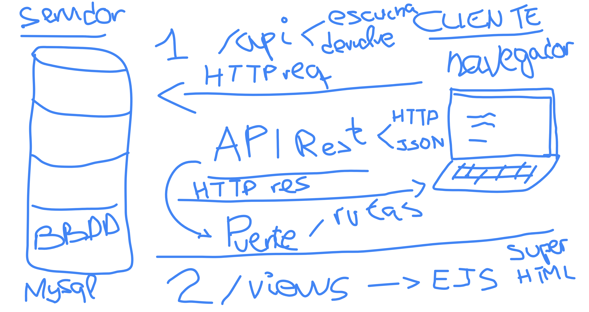

# UTN25Cuatri2_334 :frog:

# Node.js :scroll:

### Videos clase

- [Clase Node II 21/10/25](https://youtu.be/n1RsZiNaPd4)

---

### Tareas
1. [Protocolo HTTP y lenguaje HTML](https://www.youtube.com/watch?v=l6oF_RpBf64)
2. [Playlist de web de Todocode](https://www.youtube.com/watch?v=lC6JOQLIgp0&list=PLQxX2eiEaqbxx6Ds5bd1F6LZJo7_OnZhV)
    - Arquitectura cliente servidor
    - Protoclo HTTP
    - Opcional, librerias y frameworks
    - Que es JSON
    - Que son las APIs

---

## Guia Git

Vamos a trabajar con la consola de la terminal de VSCodium o VSCode -> `Ctrl + ñ` o `Ctrl + j`
Pueden probar a cambiar en el desplegable de la terminal a `Git Bash`

### 1. Configuracion inicial de git

Definimos nuestro nombre de usuario y nuestro email
Para limpiar la terminal escribimos `clear` o `Ctrl + l`

```sh
git config --global user.name "CosmeFulanito"
git config --global user.email "cosme@fulanito.com"

# Para chequear nuestros datos de git usaremos el comando
git config --list
```

### 2. Clonamos nuestro reposistorio
```sh
git clone https://github.com/profexabi/repositorioPruebas.git

# Navegamos hasta nuestro nuevo repositori
cd repositorioPruebas

# Podremos listar nuestro remotos con
git remote -v

# Y cambiar el nombre a algun remoto con 
git remote rename origin github
```

### 3. Comandos fundamentales 

Por defecto, trabajamos en la rama principal `main`

```sh
# Ver el estado de los archivos
git status

# Guardamos los cambios totales
git add .

# O guardar solo un cambio con
git add nombreArchivo


# Una vez guardados estos cambios, los registramos (los commiteamos)
git commit -m "Engadidos archivos index.html e css/"
```

### 4. Trabajando con ramas / branches (espacios de trabajo)

#### Convenciones de nombres para ramas
- feature/nueva-funcionalidad
- fix/correccion-error
- docs/actualizacion-documentacion
- test/agregar-pruebas


#### Un `Pull Request o PR`
Es una solicitud para fusionar cambios de una rama (espacio de trabajo) a otra, permitiendo:

    - Revision de codigo por otro compas
    - Discusion de implementacion
    - Integracion controlada


```sh
# Ver ramas existentes
git branch

# Crear nueva rama
git branch nombreRama # git branch nombre-descripcion

# Cambiar a una rama
git checkout nombreRama

# Todo junto crear y cambiar a una rama
git checkout -b nombreRama

# Trabajamos en esa rama y al modificar algo podremos obtener info
git status # para ver cambios y en que rama estamos
git diff # para ver que se agrego y que se elimino

# Con estos cambios, guardo, registro y pusheo a mi rama
git add .
git commit -m "nuevos cambios en mi rama"
git push origin nombreRama
```

- **Siempre actualicemos los cambios!!**
```sh
# Volvemos a la rama principal
git checkout main
git pull # Para traer los cambios que recien mergeamos (fusionamos)
```

- **Al terminar de trabajar en una rama, idealmente eliminemosla**
```sh
# Eliminar rama local
git branch -d nombreRama

# Fusionar ramas
git merge nombreRama
```

### 5. Registrando nuevas versiones de la app con `git tag`


### 6. Apartando temporalmente los conflictos con `git stash` y `git pop`


---


## Notas TP Integrador

## Paso 1
### Proyecto frontend
- *Reutilizamos el 1er parcial pero consumiendo nuestra propia API Rest*

- App front donde usuarios compran 2 tipos de producto

- Al finalizar la compra, creamos un boton que diga "hacer compra" o "imprimir ticket"
    - imprimir 1 ticket con la libreria Js PDF
    - registramos 1 venta (POST para registrar una venta)

#### **Explicacion del cliente**

1. Pantalla de bienvenida donde se pide insertar nombre (y guardarlo en la sesion)

2. Pantalla productos. 
    - Visualizar tarjetas de productos -> datos, img y boton agregar a carrito
    - Esta pantalla productos se ve gracias a que hacemos una peticion fetch a nuestra API Rest, [ejemplo](https://jsonplaceholder.typicode.com/users)

3. Pantalla carrito. Listado de productos añadidos al carrito. Debe permitir agregar o quitar distintas cantidades

4. Pantalla ticket. Confirmado el carrito (boton hacer compra o imprimir ticket)
    - Imprimimos un ticket en pdf con [JS PDF](https://raw.githack.com/MrRio/jsPDF/master/docs/index.html)
    - Se produce un POST a la tabla ventas (hora, cantidad de productos, precio total, etc)

---

## Paso 2

#### BBDD MySQL con las respectivas tablas 

### Proyecto backend
- Una API Rest que va a estar conectada a la BBDD y va a devolver datos

- Nuevas vistas HTML (EJS) -> Es el propio servidor el que va a generar las vistas y el HTML
- Esta vista va a ser el panel de administracion o "backoffice" que nos permitira gestionar productos y usuarios


#### **Explicacion del servidor**
Solamente vamos a crear usuarios admins! los clientes no se loguean, solamente se registra en el ticket y en la venta el nombre que pusieran en la pantalla de bienvenida

1. *Pantalla login que debe permitir ingresar correo y password* -> Conveniente dejar este paso para cuando esten hechas las pantallas

2. Con este login exitoso, pantalla dashboard que posee las siguientes vistas asi como el nav para redirigir a las pantallas de alta, baja y modificacion de productos y usuarios

    2.1 Listado de productos que trae todo el choclo de productos como nuestro parcial -> **GET**

    2.2. Pantalla para obtener productos/usuarios por su id -> **GET by id**

    2.3. Pantalla alta producto para cargar un nuevo producto son con un formulario que permita cargar sus datos y su imagen en url  -> **POST**

    2.4. Recicla el form de get by id -> Pantalla modificar producto para modificar los datos de un producto a partir de su ID -> **PUT**

    2.5 Recicla el form de get by id -> Pantalla para eliminar producto -> **DELETE**

---

## Paso 3
Ya con la API Rest andando 

### 3.1 Login basico con EJS y [bcrypt](https://www.npmjs.com/package/bcrypt)

### 3.2 Subida de archivos con Multer

### 3.3 Descarga de excel con las ventas

### 3.4 Paginacion


---


## Resumen conceptual TP



---

# Guia Node.js

## Introducción al backend
El desarrollo backend se refiere a la parte invisible de una aplicacion o sitio web, es decir, el motor que se encarga de las funcionalidades del lado del servidor.

El frontend se encarga de lo que el usuario ve e interactua, como botones, formularios, textos. Es decir, es la parte que se encarga del desarrollo de las interfaces de usuario

El backend se encarga de procesar solicitudes, manejar bases de datos. Todo lo que hay detrás y que le proporciona información a la parte visible

### Componentes principales del backend:

1. **Servidores**: Procesos que escuchan peticiones y devuelven respuestas

2. **Bases de datos**: Almacenamiento de informacion

3. **APIs**: Interfaces de comunicacion (puentes para conectar una app con otra)

4. **Autenticacion**: Gestionar usuarios y permisos

5. **Logica de negocio**: Reglas y procesos de la aplicacion

---

#### Para qué sirve?

- **Procesar datos**: Cuando un usuario envia un formulario o realiza una accion en el frontend, el backend recibe esa informacion y la procesa

- **Acceder a bases de datos**: Almacena y recupera datos de una BBDD como cuentas de usuario, productos, etc

- **Seguridad**: Protege la informacion sensible como contraseñas o datos personales

- **Autenticacion y autorizacion**: Gestionar quien puede acceder a ciertas funcionalidades o areas de la aplicacion


## Introduccion a Node.js
Node.js es un entorno de ejecuion que permite usar JavaScript fuera del navegador. Gracias a esto, podemos usar JavaScript para desarrollar aplicaciones del lado del servidor.

### Ventajas de Node.js
- JavaScript en el frontend y en el backend (mismo lenguaje)
- No bloqueante y asicrono
- Ecosistema enorme con `npm` (miles de paquetes disponibles)
- Alto rendimiento (gracias al event loop)

#### NPM
Es una amplia biblioteca de paquetes y herramientas para usar con Node.js

Clave, contar con una herramienta como NPM (Node Package Manager) o Gestor de Paquetes de Node, que va a ser como nuestro Play Store, es decir, una tienda o un almacen donde vamos a poder descargar paquetes, utilidades, herramientas, bibliotecas, es decir, cualquier funcionalidad extra para nuestra aplicacion backend.

Su proposito es facilitar la instalacion y gestion de bibliotecas y herramientas desarrolladas por la comunidad o por otros desarrolladores.
NPM nos ahorra tiempo, ya que no necesitamos construir todo desde cero, podemos aprovechar codigo de terceros, probado y optimizado. (Ej descargar un paquete que ya haga validaciones de datos)

#### Iniciando un proyecto npm
La estructura basica al trabajarcon npm consiste en inicializar un archivo `package.json`, el librito de instrucciones de nuestra aplicacion.

Para empezar a usar npm, lo primero que tenemos que hacer en cualquier proyecto es ejecutar el comando `npm init`.
Despues de esto, podemos instalar paquetes y listarlos como dependencias de nuestro proyecto.

#### Modulos en Node.js
Los modulos son como bloques de construccion que permiten organizar y reutilizar el codigo de forma eficiente. 
En lugar de tener todo el codigo en u archivo gigante, vamos a dividirlo en distintos archivos o modulos y luego importarlos en el lugar donde los necesitemos, para que nuestra aplicacion sea mas organizada, facil de entender, de mantener y de escalar.

**Node.js tiene varios modulos integrados que ya vienen listos para usar y nos permiten hacer cosas como trabajar con el sistema de archivos, manejar rutas o realizar tareas en red**.


---

## [Instalando Express.js](https://www.npmjs.com/package/express)

```sh
npm i express
```

`Express.js` es un framework web para Node.js que nos permite construir servidores y aplicaciones web de forma rapida y sencilla

- Es minimalista
- Nos permite crear rutas
- Manejar peticiones HTTP
- Aplicar middlewares y mucho mas

---


### Guia Git
#### [Machetes de git](https://drive.google.com/drive/u/1/folders/1T1LEYs_H-NACabUJcdTXjodw8il6ZDsf)

1. [Instalar git](https://git-scm.com/book/es/v2/Inicio---Sobre-el-Control-de-Versiones-Instalaci%C3%B3n-de-Git)

2. Clonar un repo que creamos en github
```sh
git clone https://gitlab.com/profexabi/UTN25Cuatri2_334.git
```

3. Trabajar sobre ese repo

4. (Primera vez que usamos) Indicamos nuestro nombre de usuario e email
```sh
git config --global user.name "Tu Nombre"
git config --global user.email "tu.email@ejemplo.com" # Mismo email que tengamos en github

# Podemos ver donde tenemos almacenado el repo (podemos tener un mismo repo en distintos lugares, github, gitlab, bitbucket)
git remote -v

# Podemos cambiar el nombre de nuestro remoto
git remote rename origin github # cambiamos el nombre por defecto de origin a github

# Podemos tambien añadir otros remotos con el comando
# git remote add gitlab https://gitlab.com/profexabi/UTN25Cuatri2_334.git
```

5. Chequeamos los cambios en nuestro repo
```sh
git status
```

6. Guardo todos los cambios 
```sh
git add .
```

7. Registro los cambios
```sh
git commit -m "Descripcion brevisima de los cambios"
```

8. Envio los cambios a git
```sh
# git push nombreRepo nombreRama
git push origin main
```

#### Extra
- *Registrar versiones en git*
```sh
git tag -a v1.4 -m "mi version 1.4"
```
